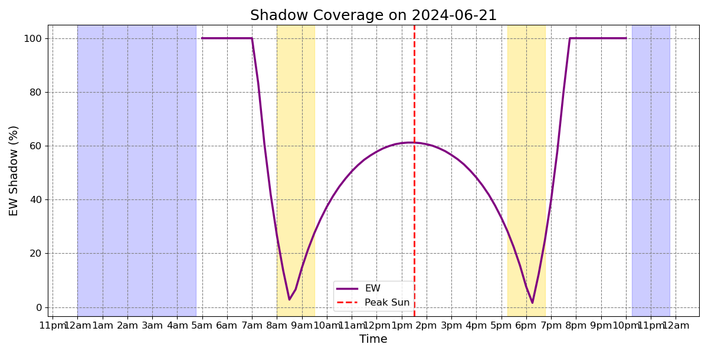
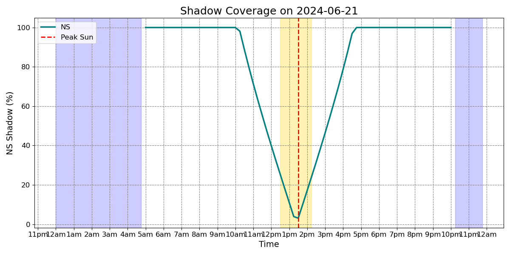

# LineShadowPlanner

A lightweight, Hydra-powered toolkit to plan drone flights along seismic lines by minimizing tree shadows. Three flavors:

1. **Simple Time Planner** (`simple_time_planner.py`)  
   Computes NS/EW shadow percentages over a day for a single location & tree height.

2. **Orientation-Only Planner** (`orientation_planner.py`)  
   Reads a GeoPackage of line geometries, computes each line’s bearing, and finds best flight windows based on that orientation.

3. **Height & Orientation Planner** (`height_orientation_planner.py`)  
   Like the Orientation-Only Planner, but also samples a canopy-height model (CHM) around each segment to estimate tree height per segment.

LineShadowPlanner was developed by the [Applied Geospatial Research Group](https://www.appliedgrg.ca/) at the University of Calgary, led by Dr. Greg McDermid, in collaboration with [Falcon & Swift Geomatics Ltd](https://www.falconandswift.ca/), an environmental consulting company supporting the planning and monitoring of recovery initiatives across Western Canada.

---

## 🚀 Features

- **Simple Time Planner**  
  - 15-minute resolution solar positions & shadow lengths  
  - NS vs. EW shadow percentages and plotting  
  
- **Orientation-Only Planner**  
  - Bearing from North → compass category (e.g. NE, WSW)  
  - Flight windows per line geometry  
  
- **Height & Orientation Planner**  
  - Segment each line into fixed lengths  
  - Sample CHM to derive 75th percentile canopy height per segment  
  - Buffer-based shadow penetration per segment orientation  
  - Flight windows and total durations per segment  

---
## 📦 Installation

### Using conda  
```bash
### Using conda  
conda create -n line-shadow-planner -c conda-forge python=3.9 pvlib hydra-core matplotlib pandas numpy
conda activate line-shadow-planner

```

### Or with pip  
```bash
pip install pvlib hydra-core matplotlib pandas numpy
```

---

## ⚙️ Configuration

In `config/config.yaml` you can set defaults for:

```yaml
location:
  latitude:     54.938643706057285   # degrees
  longitude:   -110.35322727751391   # degrees
  elevation:      800                # meters above sea level
  timezone:     "America/Edmonton"
  date:        "2024-06-21"          # YYYY-MM-DD
  freq:         "15T"                # e.g. "15T" = 15-minute intervals

orientation_planner:
  vector_path:  "/media/irina/My Book1/LiDea_Pilot/FLM/all_group_copy_ID.gpkg"
  output_field: "flight_windows"
  
height_and_orientation_planner:
  segmentation:
    segment_length:        100
    vector_path:  "/media/irina/My Book1/LiDea_Pilot/FLM/all_group_copy_ID.gpkg"
    output_field: "flight_windows"
  chm:
    path:  "/media/irina/My Book1/LiDea_Pilot/LiDea1_nCHM10cm_2023.tif"
    segment_buffer_radius: 25

```


---

## ▶️ Usage

From the project root:

```bash
python simple_time_planner.py
```
- Prints a 15-min table of solar elevation & NS/EW shadow percentages.
- Pops up an NS/EW coverage plot.

```bash
python orientation_planner.py
```
- Reads orientation_planner.vector_path
- Appends orientation (°), dir_category (N, ENE, etc.) and flight windows to the GPKG.

```bash
python height_orientation_planner.py
```
- Splits each line into segments of segment_length
- Samples CHM around each segment to get 75th‐percentile canopy height
- Computes buffer penetration % per segment orientation
- Writes segment‐level flight_windows, canopy_h75, and categories back to GPKG.
- 
---

## 📂 Project Structure

```
LineShadowPlanner/
├── config/                          
│   └── config.yaml           ← Hydra defaults for all three scripts
├── examples/                 
│   ├── EW_light.png          
│   ├── flight-planner.png    
│   └── …                      
├── simple_time_planner.py            ← NS/EW time-of-day planner
├── orientation_planner.py            ← orientation-based planner
├── height_orientation_planner.py     ← CHM + orientation planner
├── src/                       
│   └── utils.py              ← shared helper functions
├── LICENSE                    
└── README.md  
```

## 📊 Examples

### **Light conditions for EW and NS lines**  
| Light conditions for EW lines | Light conditions for NS lines |
|:-----------------------------:|:-----------------------------:|
|  |  |

These two panels show the fraction of the 10 m buffer occupied by tree shadows over a 24 h period (in 15 min steps), for a fixed tree height.

- Blue bands indicate night (solar elevation < 0°).
- Yellow fills mark periods when shadow coverage falls below your chosen threshold (e.g. 30 %).
- The vertical dashed line denotes the moment of peak solar elevation.


### **Orientation-based flight windows**  


Each colored trace represents one forest‐edge line, plotted according to its compass bearing.

- Grey shading: Night
- Yellow shading: Approved flight windows (shadow % ≤ threshold)
- Colored curve: Shadow penetration into your buffer
- Red dashed line: Peak sun

Pilots can scan the legend to match a line’s orientation (e.g. NE, SW) and immediately see its optimal acquisition windows


### **Date-specific planner snapshots**


These illustrate the full “height + orientation” planner on two dates: midsummer (21 Jun) versus later summer (11 Aug). Based on canopy heights from the CHM and each segment’s bearing, the planner assigns each segment to one of several pilot‑friendly categories:

- Fly any time: More than 8 hr of low‑shadow coverage—virtually unrestricted scheduling.
- Fly long morning + evening: ≥ 4 hr total, split between early and late in the day.
- Fly long noon: ≥ 4 hr concentrated around midday.
- Fly short morning + evening: < 4 hr but spanning early and late periods.
- Fly short noon: < 4 hr in a single midday block.
- Fly extra short: < 2.5 hr total—very tight window.

---

## 🤝 Acknowledgments

Developed by:

    Applied Geospatial Research Group, University of Calgary
         https://www.appliedgrg.ca/

    Falcon & Swift Geomatics Ltd
      https://www.falconandswift.ca/

---

## 📄 License

This project is licensed under the **MIT License**. See [LICENSE](./LICENSE) for details.

